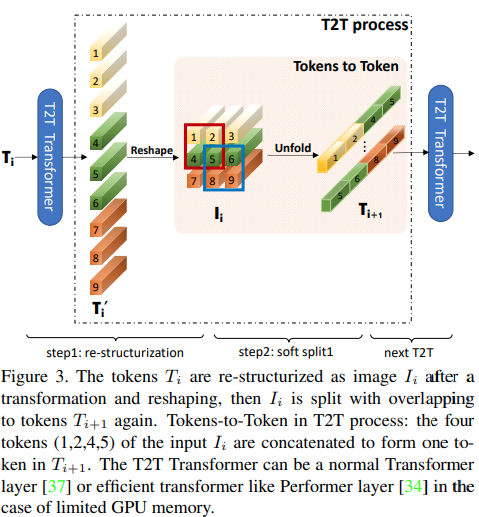

# 基于Paddle实现  ——Tokens-to-Token ViT: Training Vision Transformers from Scratch on ImageNet
## 1. 简介
### 主要改进
* 在中型数据集（例如 ImageNet）上从头开始训练时，ViT 与CNN相比性能较差。作者发现这是因为：
    * （1）输入图像的简单标记化无法对相邻像素之间的重要局部结构（例如，边缘，线条）建模，从而导致其训练样本效率低；
    * （2）ViT的冗余注意力骨干网设计导致固定计算预算中有限的功能丰富性和有限的训练样本

为了克服这些限制，作者提出了一种新的 Tokens 到 Token 视觉 Transformer（T2T-ViT），逐层 Tokens 到 Token（T2T）转换，以通过递归聚集相邻对象逐步将图像结构化为 Tokens 变成一个 Token ，这样就可以对周围 Token 表示的局部结构进行建模，并可以减少 Token 长度。

* Tokens-to-Token（T2T）模块旨在克服ViT中简单Token化机制的局限性，它采用渐进式方式将图像结构化为 Token 并建模局部结构信息；
* 而 Tokens 的长度可以通过渐进式迭代降低，每个 T2T 过程包含两个步骤：Restructurization 与 SoftSplit，见下图。  



### aistudio体验教程:https://aistudio.baidu.com/aistudio/clusterprojectdetail/3179641

## 2. 数据集和复现精度
数据集使用ImageNet 2012的训练数据集，有1000类，训练集图片有1281167张，验证集图片有50000张，大小为144GB  
aistudio上的地址为：https://aistudio.baidu.com/aistudio/datasetdetail/79807  

|  网络   | steps  |  opt  | image_size   | batch_size | dataset   | epoch  |params_size|
|  ----  | ----  | ----    |  ----       | ----          |----  | ----  |----  |
| t2t-vit  | 1252  | AdamW | 224x224    |1024        |ImageNet| 320 |16.45MB|

目标精度：71.7%
实现：71.56%
模型参数下载地址：百度网盘链接：https://pan.baidu.com/s/1A2az_B51ywsUbDCAFvXTvQ 
提取码：6ib9

## 3. 准备环境
* 硬件：Tesla V100 * 4
* 框架：PaddlePaddle == 2.2.0
* 本代码在AIstudio上可以通过fork立马运行，只需要执行里面的val.sh即可避免了环境配置的各种问题
## 4. 快速开始
### 第一步：克隆本项目
    #clone this repo    
    https://github.com/zhl98/T2T_Vit_paddle.git
    cd T2T_Vit_paddle
### 第二步：修改代码路径
修改dataset.py中的数据集路径    
1. 修改dataset的地址
2. 修改label.txt的地址
### 第三步：训练模型
运行sh文件，在文件中可以选择单卡或是多卡训练    

    bash ./scripts/train.sh
### 第四步：验证模型
    bash ./scripts/val.sh

## 4.代码结构与详细说明
### 4.1 


```

|-- T2T_ViT_Paddle
    |-- log      #日志
    |   |-- trainer-0-信息不全.log 
    |   |-- val-workerlog.0 
    |   |--trainer-0-(1).log   #有时间信息  第一步
    |   |--trainer-0-(2).log   # 第二步训练
    |-- output    #模型目录
    |-- scripts   #运行脚本
    |   |-- eval.sh
    |   |-- train.sh
    |-- tools   #源码文件
        |-- common.py    #基础类的封装
        |-- dataset.py	 #数据集的加载
        |-- scheduler.py #学习率的跟新
        |-- t2t.py		 #网络模型定义	
        |-- train.py	 #训练代码
        |-- val.py		 #验证代码
    |-- README.md      

```


